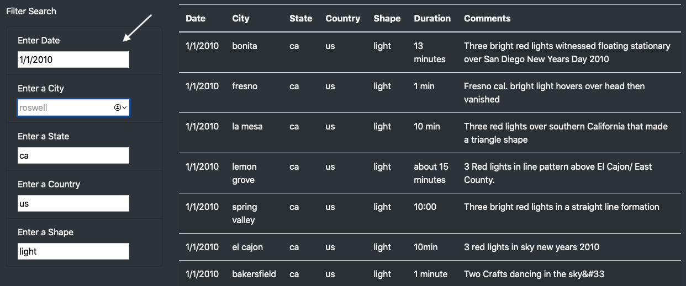

# UFOs Sighting Finder
## Overview
This analysis is to develop a website to search for UFO sightings using Javascript.
## Results
- A basic website for UFO finder was built with a table with all UFO signtings. The table was made dynamic and filterable by filter search on the side.
- To perform search, usesr will use the "Filter Search" function. The table is filtered by entering "Date","City","State","Country"and "Shape". User can type in the input of each filter criteria and press enter, the dynamic table will show the filtered results. To restart the search, user can clear the input and press enter again. 
 
## Summary
### Current model
We build a basic website for UFO finder that result is searchable by key factors. One drawback with the current desing is the input is not straigtforward shown. The current table contains limited UFO signting data which is easier for user to look at the criteria they want to filter with. However, if we put in more data, it will be impossible for user to view the whole data table to see type in the filter keywords.
### Future diretions 
- We can improve the current model by changing the filter input to pull down menu with all the options shown, so it will be easier for user to choose and filter the data.
- We can also add a button to clear the input so user can save the time of clearing each input one by one.